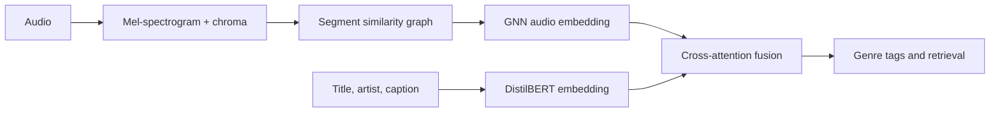

# GNN-BERT Music Context

> **Can a model understand a song better when it reads the metadata and listens to the structure at the same time?**

This project explores that question with a multimodal pipeline that combines **DistilBERT**, **audio graphs**, **mel-spectrograms**, and **contrastive learning**. Text describes the track; the graph describes how its audio segments relate; the fusion model learns to use both views together.

[](https://github.com/JuhaWorks/gnn-bert-music-context)
[](https://www.python.org/)
[](https://pytorch.org/)

## Why this project?

Music is not just a label or a waveform. A title and artist name provide context, while the arrangement, timbre, and transitions provide another kind of context. This repository compares unimodal and multimodal approaches across four experiments:

| Task | Question | Main component |
| --- | --- | --- |
| 1. Text tagging | What can metadata and captions tell us? | [DistilBERT encoder](src/bert_encoder.py) |
| 2. Audio baseline | Does a graph help beyond a CNN? | [CNN](src/cnn_baseline.py) vs. [GNN](src/gnn_model.py) |
| 3. Fusion | Does text improve audio understanding? | [Cross-attention fusion](src/fusion_model.py) |
| 4. Retrieval | Can audio and language find each other? | [Dual encoder](src/contrastive.py) |



## Results at a glance

The tracked evaluation snapshot is available in [`results/metrics.json`](results/metrics.json). Highlights:

- **Text tagging:** 0.275 macro-F1 and 0.5055 micro-F1.
- **Audio comparison:** the GNN reaches 0.1321 macro-F1 versus 0.1131 for the CNN baseline.
- **Fusion:** 0.0558 macro-F1 and 0.2875 micro-F1 on the recorded evaluation split.
- **Qualitative outputs:** see the [retrieval examples](results/retrieval_examples/) and [generated plots](results/plots/).

These numbers are an experimental snapshot rather than a benchmark claim. The training scripts intentionally use small subsets so the workflow can run on modest hardware or in Google Colab.

## Datasets and direct links

The raw audio and archives are intentionally **not committed** to this repository. Download them locally with [`src/download_data.py`](src/download_data.py).

| Dataset | Use in this project | Link |
| --- | --- | --- |
| **FMA-small** | Audio, genres, and track metadata for the graph and classification tasks | [FMA project page](https://github.com/mdeff/fma), [FMA-small audio archive](https://os.unil.cloud.switch.ch/fma/fma_small.zip), [FMA metadata archive](https://os.unil.cloud.switch.ch/fma/fma_metadata.zip) |
| **MusicCaps** | Natural-language music captions for text and cross-modal experiments | [MusicCaps dataset](https://github.com/google-research-datasets/MusicCaps), [public CSV](https://huggingface.co/datasets/google/MusicCaps/blob/main/musiccaps-public.csv) |
| **YouTube audio** | Optional short audio samples downloaded for MusicCaps examples | [yt-dlp](https://github.com/yt-dlp/yt-dlp) |

Please follow the dataset licenses and terms from the original sources. FMA metadata includes its own licensing information in the downloaded archive.

## Quick start

### 1. Create an environment

```bash
python -m venv .venv
```

Windows PowerShell:

```powershell
.\.venv\Scripts\Activate.ps1
```

macOS/Linux:

```bash
source .venv/bin/activate
```

Install the dependencies:

```bash
pip install -r requirements.txt
```

### 2. Download the data

This downloads FMA metadata, FMA-small, the MusicCaps CSV, and a small optional MusicCaps audio sample:

```bash
python src/download_data.py
```

The downloader supports resuming interrupted archive downloads. It writes everything under `data/raw/`, which is ignored by Git because the audio archives are several gigabytes.

### 3. Build the splits and audio representation

```bash
python src/prepare_fma.py
python src/audio_features.py
python src/graph_builder.py
```

The resulting tensors and graphs are written to `data/processed/`. Paths and model settings live in [`config.yaml`](config.yaml).

### 4. Train an experiment

Run one of the three classification tasks:

```bash
python src/train.py --task 1
python src/train.py --task 2
python src/train.py --task 3
```

For the cross-modal retrieval experiment:

```bash
python src/train_task4.py
```

Training automatically uses CUDA when it is available and falls back to CPU. For limited hardware, reduce `training.epochs`, `training.batch_size`, or the subset sizes in the training scripts.

## Explore the project

- [`notebooks/eda.ipynb`](notebooks/eda.ipynb): inspect the data and audio features.
- [`notebooks/demo_context.ipynb`](notebooks/demo_context.ipynb): walk through the context model.
- [`src/audio_features.py`](src/audio_features.py): turn audio into mel-spectrogram and chroma features.
- [`src/graph_builder.py`](src/graph_builder.py): connect similar audio segments into graphs.
- [`src/evaluate.py`](src/evaluate.py): compute metrics and save evaluation plots.
- [`src/case_studies.py`](src/case_studies.py): generate qualitative examples.
- [`report/main.tex`](report/main.tex): source for the final technical report.
- [`results/final_report.md`](results/final_report.md): readable report summary and findings.

## Project map

```text
gnn-bert-music-context/
├── config.yaml             # Experiment configuration
├── data/
│   ├── raw/                # Downloaded locally; excluded from Git
│   ├── processed/          # Extracted features and graph tensors
│   └── splits/             # Train/validation/test metadata
├── notebooks/              # EDA and end-to-end demonstration
├── results/                # Metrics, plots, checkpoints, and examples
├── report/                 # LaTeX report source
└── src/                    # Downloading, preprocessing, models, and training
```

## Reproducibility notes

The repository stores code, configuration, representative processed outputs, metrics, plots, and report files. Large source archives remain local and can be recreated from the links above. The current experiments use compact subsets for practical iteration; change the subset limits and configuration when running a full study.

## Citation and acknowledgements

This project builds on the [Free Music Archive dataset](https://github.com/mdeff/fma), [MusicCaps](https://github.com/google-research-datasets/MusicCaps), [PyTorch Geometric](https://github.com/pyg-team/pytorch_geometric), and [Hugging Face Transformers](https://github.com/huggingface/transformers). Please cite and credit the original projects when using this work.
