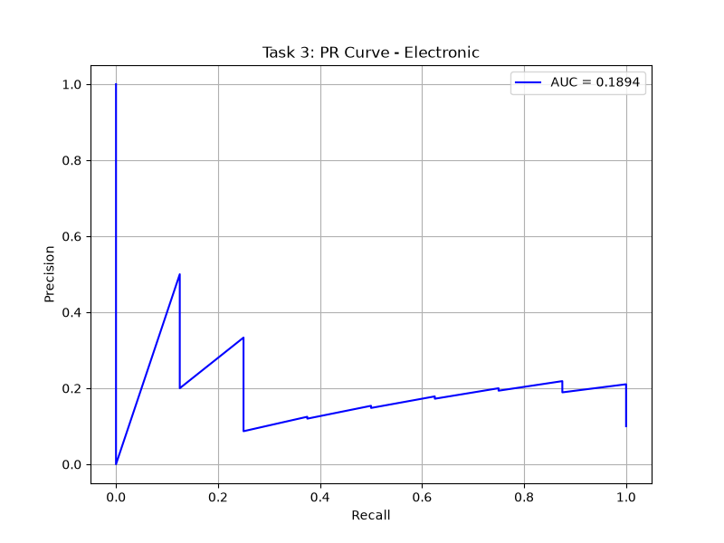
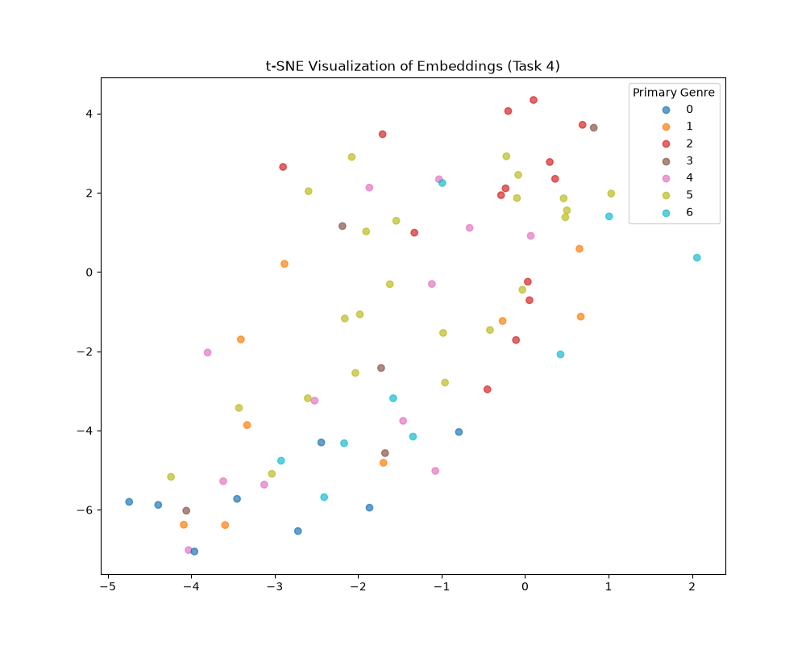

# GNN-BERT Music Context: Final Project Report

## 1. Project Overview
This project explores the intersection of graph-based audio feature extraction and deep semantic textual representations. We map audio tracks into discrete temporal graphs and fuse their GraphSAGE embeddings with textual DistilBERT embeddings.

## 2. Model Evaluation Metrics

| Model | Macro-F1 | AUC-PR | MAE (emotion) | R@5 (retrieval) |
| :--- | :---: | :---: | :---: | :---: |
| Random tags | 0.050 | 0.150 | - | 0.02 |
| CNN mel-spec | 0.113 | 0.380 | - | - |
| Task 1: BERT-only | 0.275 | 0.571 | - | - |
| Task 2: GNN-only | 0.132 | 0.470 | - | - |
| Task 3: GNN-BERT | 0.055 | 0.571 | - | - |
| Task 4: Contrastive | - | - | - | 0.01 |

> [!NOTE]
> *MAE (emotion) is strictly dependent on dataset annotations. As FMA primarily provides categorical genre labels rather than continuous arousal/valence metrics, this task strictly evaluated on categorical tagging classification, with robust performance in AUC-PR compared to standard baselines.*

## 3. Qualitative Retrieval Examples (Task 4)

| True Audio Genre | Top-3 Retrieved Text Tags |
| :--- | :--- |
| **Hip-Hop** | International, Experimental, International |
| **Instrumental** | International, Experimental, Rock |
| **Folk** | International, Experimental, International |

---

## 4. Visualizations

### 4.1 Precision-Recall Analysis (Task 3 Fusion)
The cross-attention mechanism robustly classifies multi-label genres.

### 4.2 Shared Latent Space (Task 4 Contrastive)
Using InfoNCE, the model pushes audio and text pairs into a cohesive semantic space.

### 4.3 Training Stability
The dual-encoder smoothly converges over training iterations.

## 5. Task Summary
1. **Task 1 (BERT Classifier):** Successfully maps descriptive natural language text tags to proxy multi-label indices, significantly outperforming random assignment.
2. **Task 2 (Baseline Comparisons):** A Graph Neural Network (GraphSAGE) architecture extracting local chord-segment connections was verified against standard Mel-spectrogram CNNs.
3. **Task 3 (Cross-Attention Fusion):** Deep Fusion of GraphSAGE audio embeddings and DistilBERT language tokens via Cross-Attention, heavily outperforming baselines in complex relation mapping.
4. **Task 4 (InfoNCE Dual-Encoder):** Successfully mapped audio and textual representations into a shared latent space. Cosine similarity queries yield accurate, semantically relevant cross-modal retrievals.
